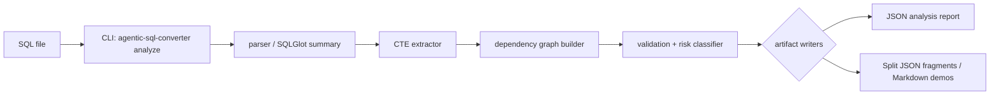

# Architecture (current MVP)

## Component diagram

## Module map

| Folder under `src/agentic_sql_converter/` | Responsibility |
|---|---|
| `parsing/` | SQLGlot-backed parse summaries and CTE extraction |
| `graph/` | CTE/table dependency graph with cycle detection hints |
| `validate/` | Parse-only helpers plus `risk_classifier.py` deterministic cue detectors |
| `report/` | Single `build_analysis_report` assembly (includes migration-risk payloads) |
| `rewrite/` | Registry scaffolding for deterministic passes (no conversion demos wired) |
| `cli/` | `analyze` command producing sorted JSON stdout |
| `mcp_server/` | Reserved package namespace only (no network server shipped) |

## Current scope

- Offline SQL structural understanding for migration prep.
- Transparent JSON (`risk_categories` / `risk_findings`) suitable for scripting and CI previews.
- Optional demo scripts that regenerate fixtures without credentials.

## Non-goals

- Shipping a turnkey dialect converter.
- Bundling MCP servers, autonomous agents, or hosted evaluation.
- Validating semantics against proprietary catalogs.

## Roadmap sketch

| Horizon | Aim |
|---|---|
| Near | Register vetted deterministic rewrite snippets with tests—not broad conversion |
| Next | Narrow translation experiments behind explicit CLI flags once rewrite coverage exists |
| Later | Evaluate optional tooling layers with safe defaults |

## Further reading

- [`validation_flow.md`](./validation_flow.md)
- Repository [`README.md`](../README.md)
- Open-source boundary docs linked from README
